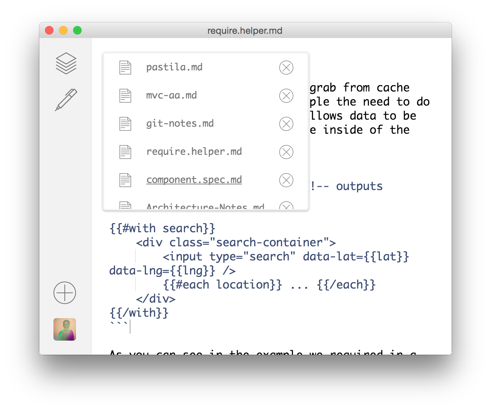

# Pastila App

a app lets you takes notes via markdown and github gist.

This is a small app built on [Electron](https://github.com/atom/electron). The client portion of the app is build in [React](https://facebook.github.io/react/index.html).



## Install

You will need to be running something `>=0.12.0 node` or `iojs` to install the deps due to the native modules.

```shell
git clone git@github.com:jcblw/pastila.git
```

To install the dependencies do.

```shell
npm install
```

## Running App

```shell
npm start
```

## Making a build

If your developing on the app, and are saving data into the app when creating a build all that data will be transfered to the newly created app. Sometimes this is fine. 

### Basic build

```shell
npm run build
```

### Clean Build

> If you are developing something and have not commited it yet, beware of clean builds it runs `git clean -xdf` and will remove any files not tracked yet. This is good tho so there is no left over data in the app.

```shell
npm run cleanbuild
```
